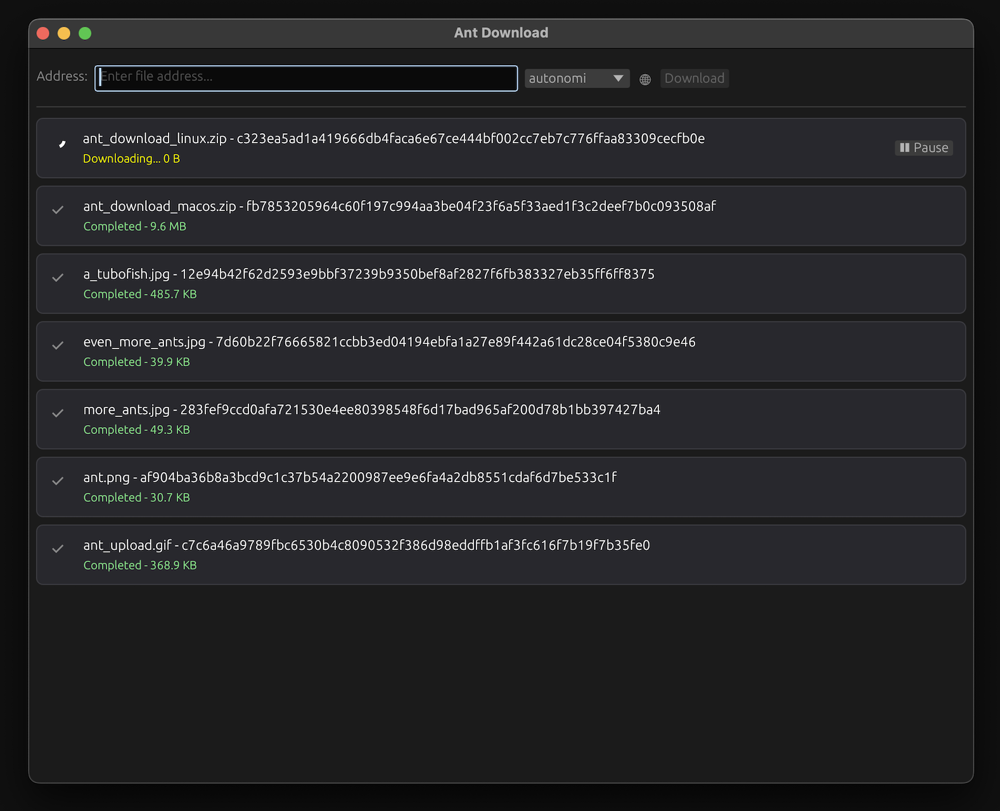

# Ant Download

Download files from the Autonomi Network — one click to eternal access.

Censorship-proof, universally available, and free for everyone.

Download files that were uploaded to the network forever.

Liberate the world's knowledge — access it from anywhere



## Download it

[Download the latest release on github with a click!](https://github.com/grumbach/ant_download/releases/latest) 

Or download directly from the Autonomi Network:

```bash
# macOS aarch64
ant file download fb7853205964c60f197c994aa3be04f23f6a5f33aed1f3c2deef7b0c093508af AntDownload-aarch64-apple-darwin.zip

# Linux aarch64
ant file download c323ea5ad1a419666db4faca6e67ce444bf002cc7eb7c776ffaa83309cecfb0e AntDownload-aarch64-unknown-linux-musl.zip

# macOS x86_64 
ant file download a9bcfbdb6def994ffa1089f3cf34099f5db807f83a42f399acfcf4ab5b55ca69 AntDownload-x86_64-apple-darwin.zip

# Linux x86_64
ant file download 745be3e4e43e7c0c3a06979d46a74dab09a9968b44eb7587757ac4e86ff9a061 AntDownload-x86_64-unknown-linux-musl.zip
```

*AntDownload was uploaded to the Network using [AntUpload](https://github.com/grumbach/ant_upload)!*

> Mac users might face quarantine issues: `"AntDownload.app" is damaged and can't be opened. You should move it to the Trash.`
>
> This happens because we don't have a $99 a year Apple Developer account :(
>
> To fix this:
> 1. **Unzip** the file (double-click the `.zip`).
> 2. Open **Terminal** (press `Cmd + Space`, type "Terminal", and press Enter).
> 3. Go to your Downloads folder:
>   ```bash
>   cd ~/Downloads
>   ```
> 4. Remove macOS quarantine flag:
>   ```bash
>   xattr -rd com.apple.quarantine AntDownload.app
>   ```
> 5. Double-click **AntDownload.app** to open it!

## Build it from source

```bash
# build the release version of the app
cargo build --release

# (for macOS) make a AntDownload.app
bash ./assets/mac_os_bundle.sh
```

## Run it from source

```bash
cargo run --release
```

## For those diving into the code

- The `src/server.rs` file contains the main logic for all autonomi network interaction
- The `src/main.rs` contains the GUI front-end for the app (100% vibecoded)

## Features

- Download files from the Autonomi Network using file addresses
- Simple copy-paste interface
- Cross-platform support (Linux, macOS)
- Free downloads forever

## Coming soon

- Retry failed downloads
- Download history
- Resume downloads on app restart
- Suggest more features by submitting or upvoting an issue on github